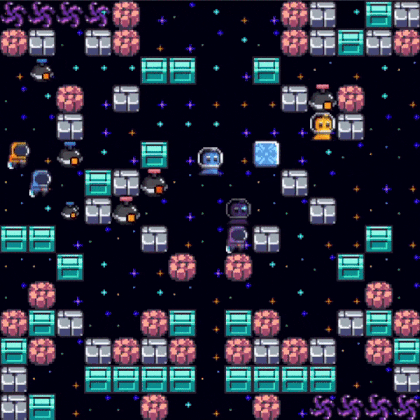

# Bomberland 2022 2nd place agent.

## About

[Bomberland](https://www.gocoder.one/bomberland) is a multi-agent AI competition inspired by the classic console game Bomberman.

Teams build intelligent agents using strategies from tree search to deep reinforcement learning. The goal is to compete in a 2D grid world collecting power-ups and placing explosives to take your opponent down.

This repo contains the source of the Eop's agent which finished 2nd on 2022 season.
Earlier version that finished 1st in 2021 season can be found [here](https://github.com/ktolnos/Bomberland-AI-challange).



## Usage

### Basic usage

See: [Documentation](https://www.gocoder.one/docs)

1. Clone or download this repo (including both `base-compose.yml` and `docker-compose.yml` files).
1. To connect agents and run a game instance, run from the root directory:

```
docker-compose up --abort-on-container-exit --force-recreate
```
## Code overview

Agent's main logic is called from the [`rule_policy.py`](./agent/rule/rule_policy.py). 
- All agent's files are in [agent/](agent/) folder. 
- [agent/parsing/](agent/parsing/) folder contains code for parsing json state object into data classes and populating different maps (e.g. wall map).
- [agent/rule/](agent/rule/) folder contains code for the main policy, including all the strategies. 
    - [agent/rule/state/](agent/rule/state/) contains logic for parsing and updating game state related to this policy.
- [agent/search/](agent/search/) contains implementations and tests for an A\* search and a least cost search. The main idea of the latter is to find a trajectory of the fixed length that will have the lowest cost. This allows to avoid dengerous tiles and move towards the sweetest spots.
- [agent/simulation/](agent/simulation/) contains code for the simlified forward simulation of the game environment.